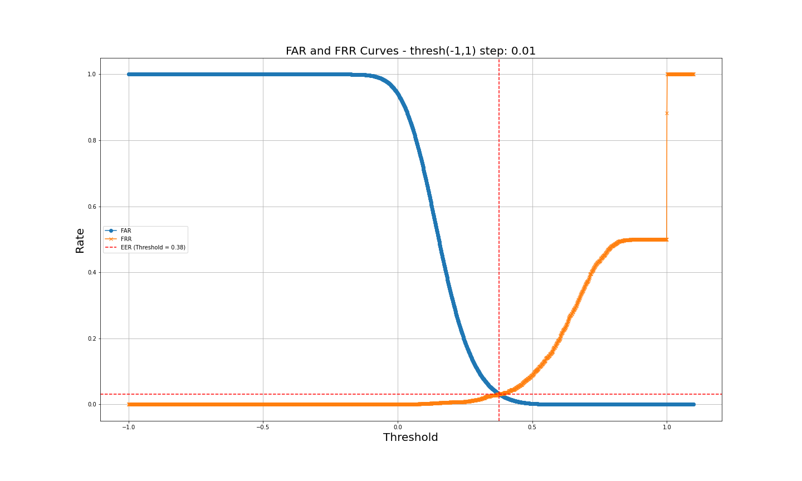

## Quickstart
### Install requirements
``` sh
conda create -n voice_verification python=3.9
conda activate voice_verification
pip install -r requirements.txt
```

### Inference using pretrained models (CAM++)


``` sh
# Run CAM++ inference
python campplus.py --wavs ./clips_wav/common_voice_ar_19058496.wav ./clips_wav/common_voice_ar_24175176.wav
```

## Test result on [Arabic voice dataset](https://commonvoice.mozilla.org/ar/datasets)
[CAM++ paper](https://arxiv.org/pdf/2303.00332)



